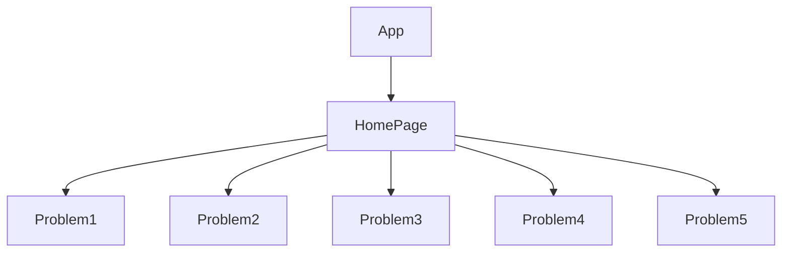

# Puzzle-For-The-Day


A Logic Puzzle Solver built with React, Vite, TypeScript, and Tailwind CSS. Puzzle data is sourced from https://logic.puzzlebaron.com.

## Live at :
https://puzzle-builder-ten.vercel.app/
## Overview

This web application allows users to solve logic puzzles with various stories. Puzzle data is dynamic and displayed in an interactive interface. Users can toggle hints, view the puzzle description, input their solutions, and check the answer.

## Features

- **Dynamic Puzzle Loading:** Fetch puzzle data based on the selected problem.
- **Interactive Interface:** View puzzle descriptions, toggle hints, and input your solutions.
- **Built with React and TypeScript:** Utilizes modern web technologies for a robust and type-safe codebase.
- **Vite framework:** used for better and fast dev experience.
- **Styled with Tailwind CSS:** Responsive and visually appealing design.

## Getting Started

1. **Clone the Repository:**

   ```bash
   git clone https://github.com/your-username/logic-puzzle-solver.git
   cd logic-puzzle-solver
2. **Install Dependencies**
   ```bash
   npm i
3. **Start the app**
   ```bash
   npm start 
  Open http://localhost:3000 in your browser.
   
## Flow



